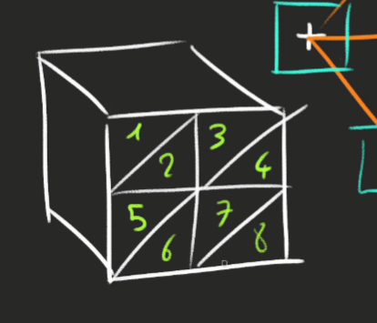
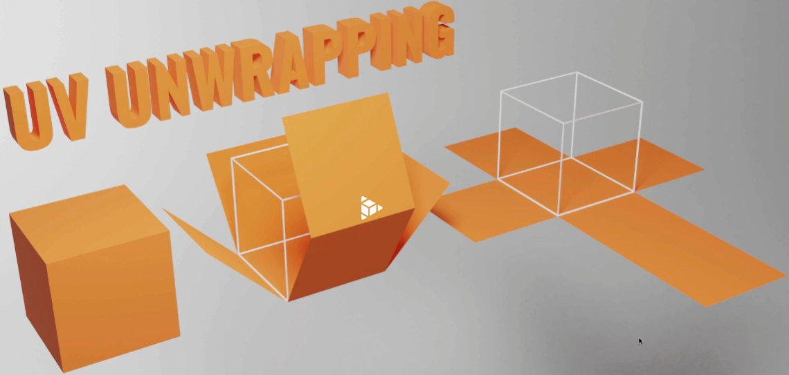
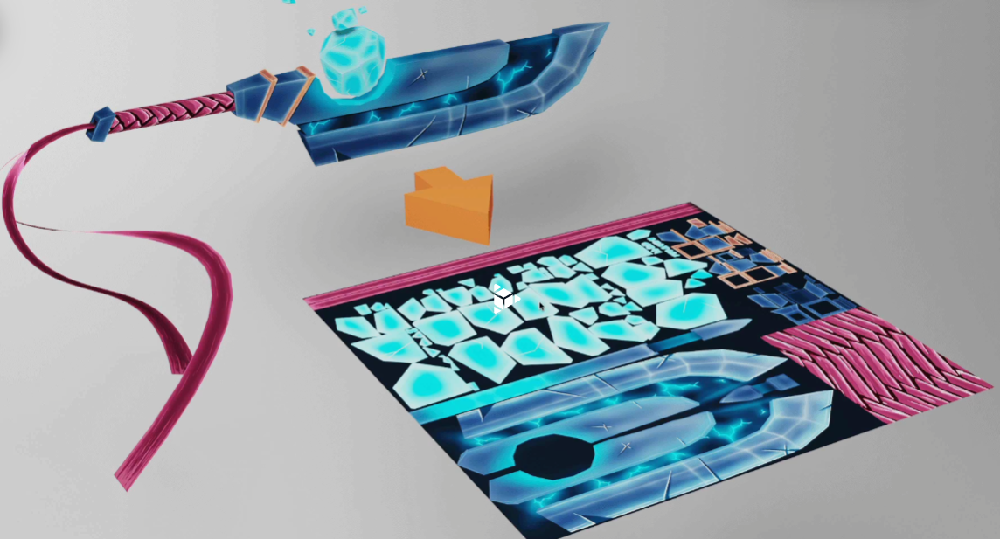

# Basics

# What is WebGl

- Javascript API that renders using the visitor GPU

**Shaders** are in charge of calculating where to place the points of the geometries and draw the pixels within them

We can also provide data to shaders, such as, how to place the points according to transformations and the camera propperties, this transformatins are called **matrices**
And finally we need to provide data on how to colorize pixels, for example in the case of lighting

WebGl is hard because it does not provide any defalult elements such as shaders or matrices

**Three.js** is a library that works on top of webGl providing out of the box resources such as shaders and matrices

A **MESH** is a combination of geometry(shape) and material(texture/how it looks)

---

**CAMERA**s are not visible, there are the point from which we look at the, you can switch along cameras if you wish usually we just use one

There are different types of cameras but for now we use a perspective camera.

Its provided by two essential parameters

- Field of view (vo) -> How large your vision angle is

  > Small angles lead to a zooming effect while Large angles lead to distortion

- Aspect Ratio -> Width divided by height of the canvas
- Near and far -> How close and far can the camera see. very small and very large values might lead to a bug called z-fighting where multiple elements fight for the same Z plane

Objects count with multiple properties such as position (xyz), rotation and scale

# Object transformations

There are for properties to transform objects:

- position (move around)
- scale (resize)
- rotation (rotate)
- quaternion (also rotate but different)

ALl of them inherit from the Object3D class

> Units are arbitrary, position of 1 can mean 1 meter, cm or Km. you need to adapt it to what you want to build

**position** property is not any object but a instance of the _Vector3_ class which has some other methods like

- `length()`
- `distance(another Vec3 Object)`
- `normalize()` direction reduce lenght of vectors to 1 but keep
- `set(x,y,z)`

### Axes helper

Its a helper class in charge of displaying each axe orientation and position on the current space

### Scale

Scale is also a vector3, with xyz defaulted in 1

### Rotation

Rotation can be accessed either by `rotation` or `quaternion`

The first one its an Euler object, and its expressed in radians

- If you spin on the y axis, you can picture it like a carousel.
- If you spin on the x axis, you can imagine that you are rotating the wheels of a car you'd be in.
- And if you rotate on the z axis, you can imagine that you are rotating the propellers in front of an aircraft you'd be in.

This type of rotation can be dangerous because the order of the rotation matters and its applied in x,y,z so one rotation might not take effect
although the order can be changed.

In order to avoid side effects the method Quaternion is used for rotation

> The command camera.lookAt(Vector 3) makes the camera look at something

### Group Class

Group class inherits from Object3D so it has the same methods `position`, `scale`, `rotation`, `quaternion`

# Animations

`requestAnimationFrame` will execute the function provided on the next frame, but if used within itself we can create a loop that never ends

If this loop is used like this a higher frame rate will lead to a higher speed, which leads to unappropriated behaviors when switching computers

Calculating a Date.now() to use as a multiplying factor helps maintiain the speed

### Clock

The CLOCK class helps getting elapsed time with the method `getElapsedTime()`

### Gsap

Gsap library is better for creating more complex animatio0ns

# Cameras

### ArrayCamera

The ArrayCamera is used to render your scene multiple times by using multiple cameras. Each camera will render a specific area of the canvas. You can imagine this looking like old school console multiplayer games where we had to share a split-screen.

### StereoCamera

The StereoCamera is used to render the scene through two cameras that mimic the eyes in order to create what we call a parallax effect that will lure your brain into thinking that there is depth. You must have the adequate equipment like a VR headset or red and blue glasses to see the result.

### CubeCamera

The CubeCamera is used to get a render facing each direction (forward, backward, leftward, rightward, upward, and downward) to create a render of the surrounding. You can use it to create an environment map for reflection or a shadow map. We'll talk about those later.

### OrthographicCamera

The OrthographicCamera is used to create orthographic renders of your scene without perspective. It's useful if you make an RTS game like Age of Empire. Elements will have the same size on the screen regardless of their distance from the camera.

### PerspectiveCamera

The PerspectiveCamera is the one we already used and simulated a real-life camera with perspective.

We are going to focus on the OrthographicCamera and the PerspectiveCamera.

> Keep in mind that many parameters coming from the window and window events may need a re-mapping
> Mouse movement events will deliver a x along the width value and y along the height value
> In order to use this for camera movements they need to be brought to normalized values

## Built In controls

### DeviceOrientationControls

---

DeviceOrientationControls will automatically retrieve the device orientation if your device, OS, and browser allow it and rotate the camera accordingly. You can use it to create immersive universes or VR experiences if you have the right equipment.

### FlyControls

---

FlyControls enable moving the camera like if you were on a spaceship. You can rotate on all 3 axes, go forward and go backward.

### FirstPersonControls

---

FirstPersonControls is just like FlyControls, but with a fixed up axis. You can see that like a flying bird view where the bird cannot do a barrel roll. While the FirstPersonControls contains "FirstPerson," it doesn't work like in FPS games.

### PointerLockControls

---

PointerLockControls uses the pointer lock JavaScript API. This API hides the cursor, keeps it centered, and keeps sending the movements in the mousemove event callback. With this API, you can create FPS games right inside the browser. While this class sounds very promising if you want to create that kind of interaction, it'll only handle the camera rotation when the pointer is locked. You'll have to handle the camera position and game physics by yourself.

### OrbitControls

---

OrbitControls is very similar to the controls we made in the previous lesson. You can rotate around a point with the left mouse, translate laterally using the right mouse, and zoom in or out using the wheel.

### TrackballControls

---

TrackballControls is just like OrbitControls but there are no limits in terms of vertical angle. You can keep rotating and do spins with the camera even if the scene gets upside down.

### TransformControls

---

TransformControls has nothing to do with the camera. You can use it to add a gizmo to an object to move that object.

### DragControls

---

Just like the TransformControls, DragControls has nothing to do with the camera. You can use it to move objects on a plane facing the camera by drag and dropping them.

### Code for full screening

```javascript
window.addEventListener("dblclick", () => {
  if (document.fullscreenElement) {
    canvas.requestFullscreen();
  } else {
    document.exitFullscreen();
  }
});
```

# Geometries

Geometries are constituted by vertices that can accept al type of properties and be made into particles

Geometries are created from `BufferGeometry`

Available geometries:

- BoxGeometry
- PlaneGeometry
- CircleGeometry
- ConeGeometry
- CylinderGeometry
- RingGeometry
- TorusGeometry
- TorusKnotGeometry
- DodecahedronGeometry
- Octahedron
- TetraHedron
- IcosahedronGeometry
- SphereGeometry
- ShapeGeometry -> Uses Bezier curves
- TubeGeometry
- ExtrudeGeometry
- LatheGeometry
- TextGeometry

Geometries are combined in order to create elements, if it gets to complex we can use a software like blender in order to manage more complex figures

All geometries have parameters related to their geometry, in the case of box would be `widht`, `height`, `depth` and afterwards they have the amount of segments we want in each face, again in the case of the box we have, `widht segments`, `height segments`, `depth segments`



We are going to design our own triangles and we are going to use the `Float32Array` which has a typed structure and fixed length

# Debug UI

We need an UI that allows us to tweak elements and their properties
The main ones are

- dat.GUI --> Replaced for Lil.gui
- control-panel
- Control.Kit
- Guify
- Oui

Elements found in GUIS

- Range - for numbers with min max values
- COlor - colors and color formats
- Text - simple texts
- Checkbox - for booleans
- Select - a choice from a list of values
- Button - To trigger functions
- Folder - To organize your panel

# Textures

Textures are images that cover the surface of a geometry
Most common types:

- Color Textures -> Color that is applied on the geometry
- Alpha -> Gray scale, white visible, black not visible
- Height -> Moves the vertices up to create texture, they often depend on the amount of sub division
- Normal -> Adds details regarding light, does not need subdivision, the vertices do not move, lure the light about the face, has better performance
- Ambient Occlusion -> another grayscale, adds fake shadows in crevices (angles), not phisically accyurate, helps creat contract
- Metalness -> Grayscale where white is metallic and is mostly used for reflections
- Roughness -> Grayscale where white is rough and black is smooth

This textures follow Physically based rendering (PBR) principles, where the technics are oriented for getting realistic results

`LoadingManager` is a class that helps us display an understand how the loading progress is

### UV UNWRAPPING

We map each vertex to a 2D plane usually a square or rectangle
  


In three JS each geometry has a UV property which is a Float32Buffer which with all the coordinates of the shape. This is what we use to map textures

**To make your custom geometries and 3d elements you need to unwrap with blender since you need your own UV coordinates**

# Transforming Textures

Each texture has properties such as

- repeat (x,y) -> Repeats the last pixel of the texture, with wrap you can repeat the texture over the geometry
- wrap (s,t) -> repeats the texture
- offset (x,y) -> which displace the texture
- rotation (x,y) -> rotates the texture
- center -> Where the texture's center of rotation located

# Mip Mapping & Filtering

Amount of pixels I can see from the distance to the object

- Minification filter -> its applied when te texture is too big for the surface, we can change it by change the `minFilter` in the texture object, belows are the possible
  - THREE.NearestFilter
  - THREE.LinearFilter
  - THREE.NearestMipmapNearestFilter
  - THREE.NearestMipmapLinearFilter
  - THREE.LinearMipmapNearestFilter
  - THREE.LinearMipmapLinearFilter

.jpg carries compression but is lighter
.png lossless compression but its usually heavier

Using multiple textures we need to send them as small as possible in order to optimize **GPU performance**

Mip Mappings need textures that are divisible by 2

Websites to find textures:

- poliigon.com
- 3dtextures.me
- arroway-textures.ch

# Materials

Are used to put colors in the geometry
